# Building OpenAutoLab

This is a detailed description of building OpenAutoLab.

If you are using a plant container for heated water bath, note that you may have to move around some of the components a little, since different containers may have inner structures you need to avoid, see section about lower rail.
If you have any pre-built modules like main board or one of the rails, just skip the section.

If you are 3d-printing the parts yourself, please refer to [making parts](making_parts.md), it contains useful information about the print settings and post-processing.

If you want to change the measurements of some parts, due to differently sized magnets, hoses, threaded rods or other components, refer to [modifying parts](modifying_parts.md), it describes how to modify parametric models of all 3d-printable parts to meet your needs.

## Building frame

By the end of this chapter you will have the skeleton of the machine with most components mounted on the frame.

### Building upper rail: valves, pumps and mount for electronic box

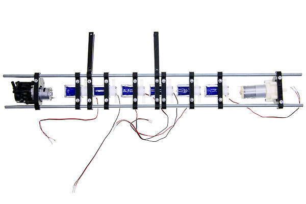

By the end of this section you will have non-water-tight top part of the machine.
It is possible that you will have to change placement of some parts due to individual differences in size of components sourced from different manufacturers.
The difference should not be drastic, so the mentioned measurements are a good reference.

#### Parts list

| No | Part | Quantity | Filename if 3d-printable |
| --- | --- | --- | --- |
| 1 | Main pump | 1 | |  
| 2 | Two-part bracket for the main pump | 1 | upper_rail_main_pump_bracket.stl |  
| 3 | Fresh water pump | 1 | |
| 4 | Two-part bracket for the fresh water pump | 1 | upper_rail_filter_pump_type1_bracket.stl or type2 |
| 5 | magnetic valves | 6 | |
| 6 | two-part brackets for the valves | 6 | upper_rail_valve_bracket.stl |
| 7 | two-part brackets for the electronic enclosure | 2 | upper_rail_enclosure_bracket.stl |
| 8 | M4x15 screws | 18 | |
| 9 | M4x20 screws | 3 | |
| 10 | M4 nuts | 16 | |
| 11 | M8 threaded rods of length 600mm | 2 | |

When building the rail together, do not tighten the screws all the way, keep the assembly somewhat flexible, as you may want to move the brackets around before fixing them in place.

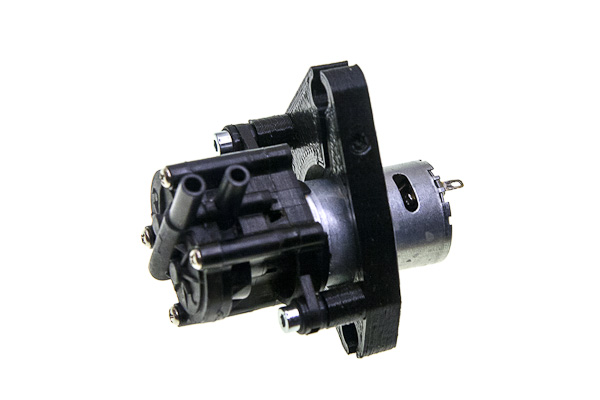

Take the main pump and mount it on its bracket with two M4x15 screws.

Push the threaded rods through the mount and tighten the M4x20 screw fixing the position of the pump about 20mm away from the leftmost end of the rod.
Note that connecting pipes should point upwards from the pump.
It starts better when the gears inside of it are immersed into a small amount of remaining liquid, rather then when the gravity completely pulls the liquid out.

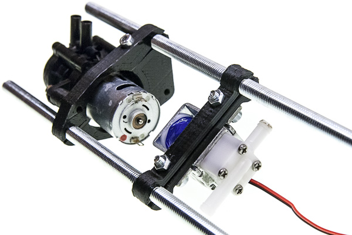

Take one of the valves and fix it about 2cm away from the pump leaving some space for the electrical connections.
Use M4x15 screws and nuts.
Mind the orientation at which the valves are mounted: they are better holding pressure in one direction than in the opposite one, which corresponds well to higher pressure generated by pump pushing liquids towards the valves in comparison to sucking through them, which cannot create pressure difference greater than atmospheric.

Mount the rest of the valves onto the rail about 5mm apart from one another.

Take the fresh water pump brackets and screw them together with two M4x20 screws leaving 3mm gap.

Place the pump between the brackets, and mount them onto the rail, about 20mm away from the rightmost valve.

Now mount the brackets for electronic enclosure.
You may have to push around the valves to make space for correct placement of the brackets.

The distance between the brackets should be exactly the same as the distance between the mounting points of the PCB and therefore of the enclosure.
About 12mm to the right from the first and 3mm to the right from the fourth valves is a good place for the brackets, this way the wires from each of the valves should reach their respective connectors on the PCB without problems.

When you are sure that all parts fit nicely, tighten all the screws.

### Building lower rail: vessel and tank interfaces and mounts

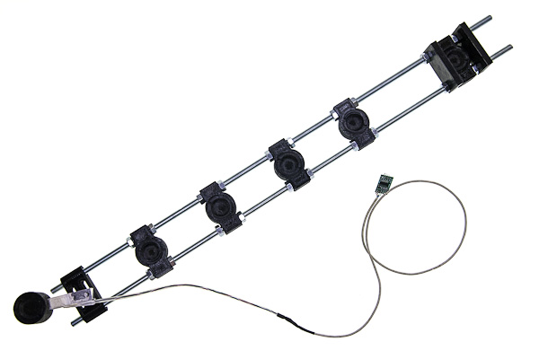

By the end of this section you will have a water-tight bottom part of the machine.
It is possible that you will have to change placement of some parts due to differences in placement of the structures inside the outer box.

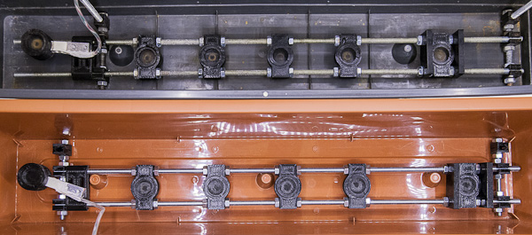

The difference should not be drastic, the picture is a good reference anyway.
If the force gauge was not originally waterproof, follow the instructions in [making parts](making_parts.md) to make it waterproof first.

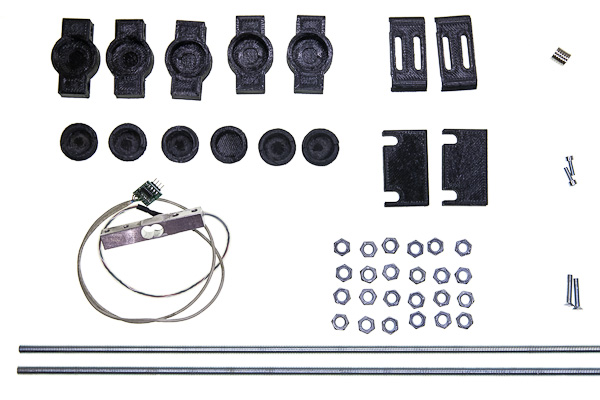

#### Parts list  

| No | Part | Quantity | Filename if 3d-printable |
| --- | --- | --- | --- |
| 1 | rod-mountable magnetic holders | 5 | lower_rail_magnetic_holder.stl |
| 2 | bar-mountable magnetic holder | 1 | lower_rail_magnetic_holder_wg.stl |
| 3 | force-gauge mounting brackets | 2 | lower_rail_weight_gauge_bracket.stl |
| 4 | larger magnet covers with outer thread | 6 | lower_rail_magnetic_holder_cover.stl |
| 5 | filter supports | 2 | lower_rail_filter_support.stl |
| 6 | magnets | 6 |  |
| 7 | Waterproof force gauge | 1 |  |
| 8 | threaded rods M8 of length 600mm | 2 |  |
| 9 | M8 nuts | 24 |  |
| 10 | M6x25 screws | 2 |  |
| 11 | M4x12 screws | 2 |  |

Take two threaded rods and place one nut on each of them about 135mm from the end. Push them through one magnetic holder and fix with two nuts on the other side.

Place two more nuts about 65mm to the right from the previous two.
Repeat nuts-holder-nuts-space pattern for a total of 4 holders.

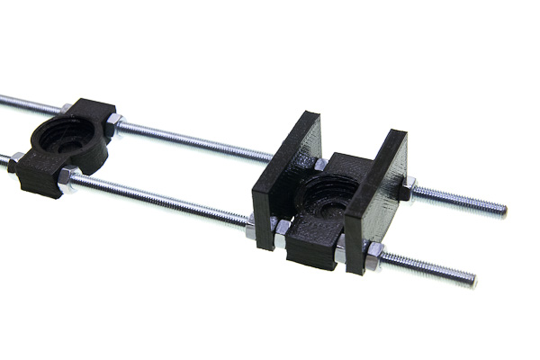

The rightmost holder is for the filter and should be further away due to filter size and requires two additional supports due to its weight and instability.
So, after the fourth holder keep about 150mm of space, then place parts in following order: nuts, support, nuts, holder, nuts, support, nuts.
The idea is that each part is fixed on both sides and is in the contact with 4 nuts in total.

Take the force gauge, and the pair of mounting brackets and fix the gauge on the left about 20mm from the very end of the rods by threading each screw through two brackets into the gauge.
Mind the orientation of the gauge, the arrow must be on the free side and should point downwards, and the angle must be fine tuned later so that the tank is as far from touching any of the walls as possible.

Mount the last holder to the other side of the gauge with two M5 screws.

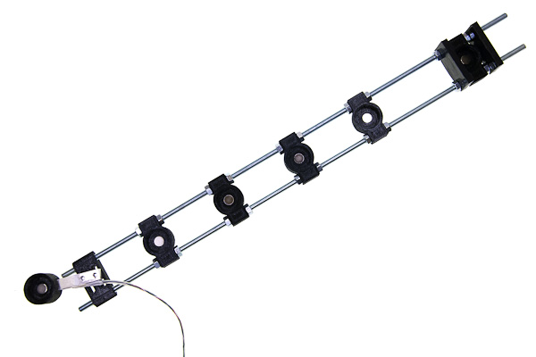

Place the magnets in the same orientation (all north pole up or all north pole down) in each of the six magnetic holders.

Screw a larger magnet cover with outer thread into each of the six magnetic holders.

### Bringing two rails together

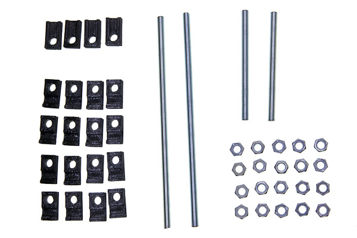

#### Parts list

| No | Part | Quantity | Filename if 3d-printable |
| --- | --- | --- | --- |
| 1 | T-mounts | 4 | frame_t-mount.stl |
| 2 | X-mounts | 16 | frame_x-mount.stl |
| 3 | M8x210mm threaded rods | 2 |  |
| 4 | M8x110mm threaded rods | 2 |  |
| 5 | M8 nuts | 20 |  |

You need to have two pairs of X-mounts on each of four rods to hold one rail on one side.
Each pair should be able to be pressed together by two nuts in order to tightly hold the threaded rod of the rail.

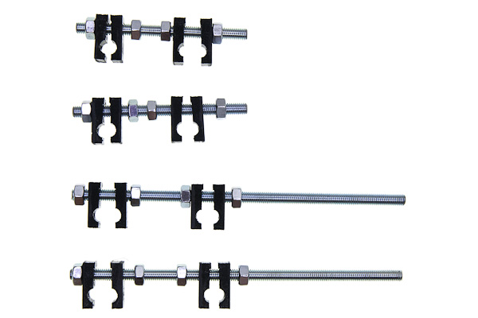

To achieve said structure, loosely put the parts in the following order on each of four rods: nut, two X-mounts (two round cutouts facing each other), two nuts some distance apart, two more X-mounts (also cutouts together), nut.

Take the upper rail and two longer (210mm long) rods.

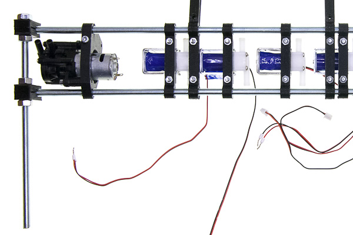

Place both ends of the rail (left and right) between pairs of X-mounts and tighten the nuts.
Make sure that perpendicular rods are in front of the rail, not on the rear side.

Repeat the same procedure with the lower rail and shorter (110mm) rods.
Note that exact placement of those perpendicular rods is not really important, the distances between them should be the same for the lower and the upper rail.
The left one could be mounted to the right or to the left of the weight gauge bracket, depending on available space in the outer container, you may have to experiment.

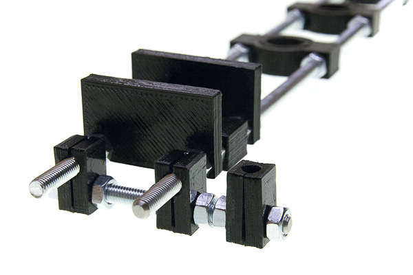

Now use 4 T-mounts to fix the rails together: each of the two newly mounted perpendicular rods of the lower rail should get a nut, a pair of T-mounts and a second nut.

The perpendicular rods of the upper rail are inserted between those pairs, which are then pressed against each other by tightening the nuts.

## Building agitation module

#### Parts listed

| No | Part | Quantity | Filename if 3d-printable |
| --- | --- | --- | --- |
| 1 | Tank cap | 1 | agitation_rod.stl |
| 2 | Agitating rod | 1 | agitation_cap.stl |
| 3 | MG90 servo | 1 |  |

If you have some special developing tank and need to make parts that fit it, or 3d-printing them for the recommended AP developing tank, refer to [modifying parts](modifying_parts.md), it has description of how to make the right rod and cap. In this document it is supposed that you already have the parts that fit your tank perfectly.

Mount the servo on tank cap in such a way, that its axis is in the center of the cap using the screws provided with the servo.

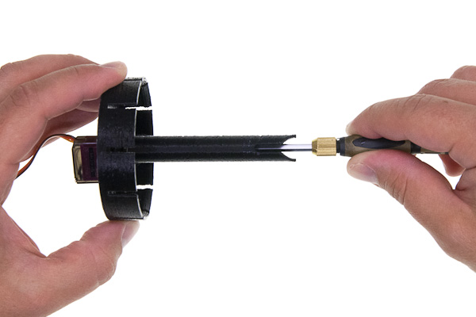

Take a long screwdriver and fix the mixing rod to the servo with the M2.5 screw also provided with the servo.

## Connecting hoses

#### Parts list

| No | Part | Quantity | Filename if 3d-printable |
| --- | --- | --- | --- |
| 1 | Silicone hose 6mm ID, 9mm OD |  |  |
| 2 | T-connectors for 6mm hose | 5 |  |
| 3 | hose sleeve | 6 | lower_rail_hose_sleeve.stlv |
| 4 | hose adapter | 6 | lower_rail_hose_adapter.stl |
| 5 | hollow screw | 6 | lower_rail_hollow_screw.stl |
| 6 | silicone rings | 12 |  |
| 7 | straight vessel interfaces | 5 | lower_rail_interface.stl |
| 8 | Tank interface with a light-trap | 1 | lower_rail_interface_light_trap.stl |
| 9 | interface magnet cover | 6 | lower_rail_interface_cover.stl |
| 10 | Filter attachments holder | 2 | upper_rail_filter_attachment.stl |
| 11 | magnets | 6 |  |
| 12 | cable ties |  |  |

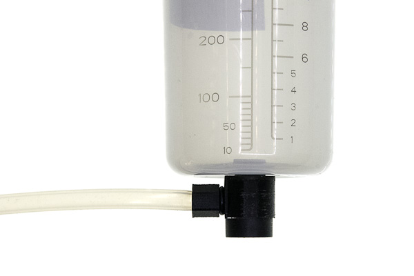

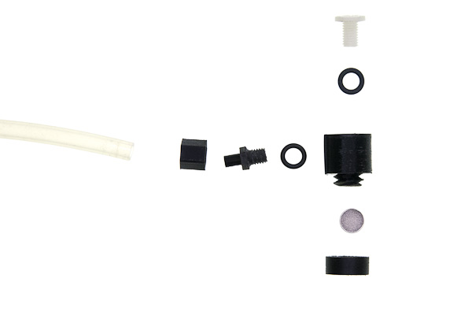

The vessels and the developing tank are connected to the hoses with interfaces, which are fancy L-shaped tubes with inner M8 threads on each end and a magnet on the bottom.
The top thread is for the hollow screw, that is put through the hole in the bottom of the vessel, a gasket ring and then tightened to the interface itself.

The side thread is for the hose adapter.
This part is designed to be interchangeable, because of how easily it could be accidentally broken.
For the same reason it is designed with redundant sleeve that holds the hose and adds to the strength of the part.

### Mounting hose adapters

Cut 6 hoses for vessels, filter and tank.
Their lengths need to be enough to connect the upper rail and the lower rail and to allow comfortable handling of vessels, mounted to them.
Recommended length is about 300mm. Now connect each hose to adapter as follows.

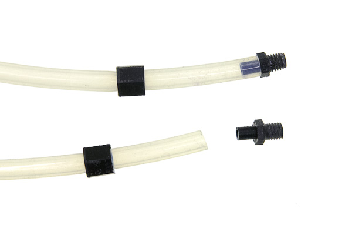

First, the sleeve is put on the hose, the side with hexagonal cutout facing the end of the hose. Then the narrow side of the adapter is put over the hose.

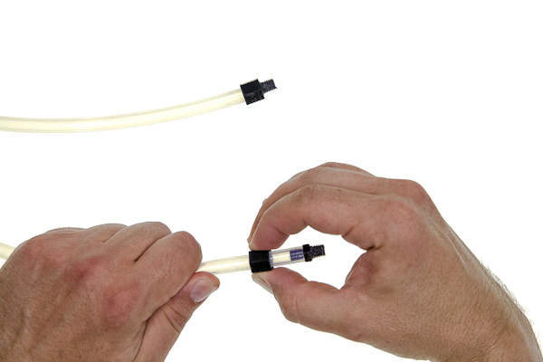

Then holding the hose with one hand, slide the sleeve with the second hand.
The pulling force will stretch the hose so it becomes narrower and it is easier to fit the sleeve on top of it, however it should be done carefully not to pull the hose away from the assembled adapter.

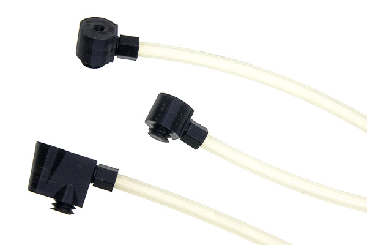

Screw those adapters on the sides of the interfaces (not on top part which is opposite to the magnet).
You can use TPFE tape, silicone or rubber ring (recommended) to make threaded connection water-tight.
Keep in mind, that in case adapter is broken, you need to be able to unscrew the thread.

### Preparing vessels and tank

Put 6 magnets into the smaller magnetic covers in the same orientation you put them into magnetic holders.

![process of screwing cap on one interface, near lie assembled and disassembled]

Screw those caps onto interfaces.

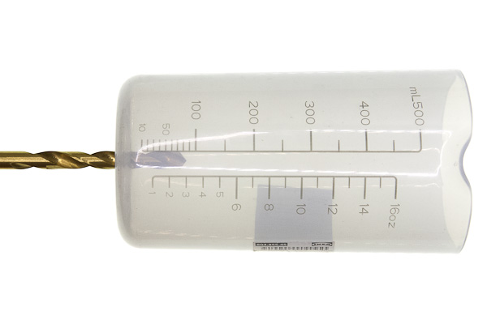

The machine is designed with AP developing tank, Ikea 500mL shakers and Brita water filter in mind.
If you are building the machine from scratch you need to drill 8mm holes in each of those items: 17mm offset from center for the tank and dead center for the others.

Then for each one of those repeat the following mounting process.

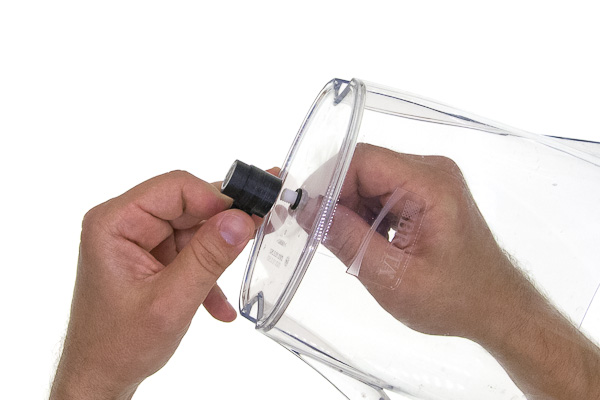

Put the hollow screw through the hole from the inner side, such that the thread is sticking outside.
Put a silicone gasket on the thread.
Screw the interface on, magnetic side down. Do not over-tight, especially if you have a 3d-printed screw.
Tighten just that the interface is not unscrewing itself when forces are applied by the dangling hose during normal operation.

### Finishing the liquid connections

Cut 5 pieces of hose, each of which is just long enough to connect a T-piece with a valve and put T-pieces on top of the five leftmost valves.
Note that the picture is taken from the back side of the machine.

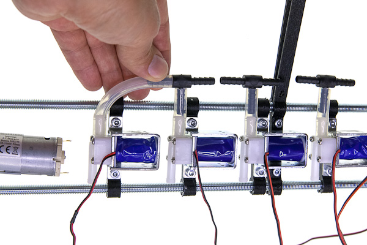

Cut one more slightly longer hose to connect the last valve to the side of the T-piece of the neighbouring one.
From now on measure the length of the hose to be cut judging from the distance of components that it connects.
Note that the picture is taken from the back side of the machine.

Cut four more short hoses and connect 5 T-pieces together. Note that the picture is taken from the back side of the machine.

Connect the main pump to the only T-piece left.

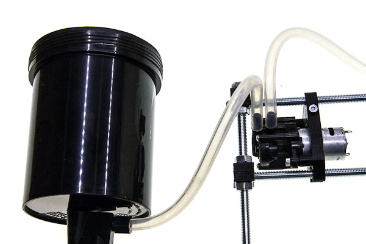

Connect the other side of the pump to the tank.

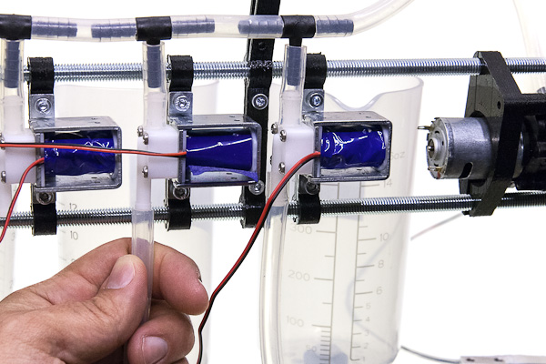

Connect the four hoses attached to two vessels, water filter to valves 1 through 6, the sixth valve is for dirty water output, it needs to be slightly longer, because it leads outside of the machine to your waste water container.

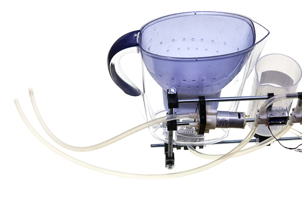

Cut the hose for clean water input about the same size as the waste water hose, it should reach the source of clean water outside the machine.
Connect it to the input of the filter pump.

Cut about 300mm long hose for the filter input.
Connect it to the output of the filter pump and fix its other side to the input of the filter.

Secure each end of each hose with a cable ties.

Put the level sensor on the filter input so the filter never overflows.

## Mounting and connecting electronics

If you want to make the PCB yourself, or just to understand its work better better, refer to [main_board](../main_board/README.md) subdirectory of the repository.
It contains schematics and board layout in KiCAD format, along with some insights about its production.
In this document it is supposed that you already have a PCB with all components soldered to it.

### Mounting PCB

#### Parts list

| No | Part | Quantity | Filename if 3d-printable |
| --- | --- | --- | --- |
| 1 | PCB | 1 |  |
| 2 | 20x04 LCD display with i2c interface | 1 |  |
| 3 | Front half of the electronic enclosure | 1 | enclosure_front.stl |
| 4 | Back half of the electronic enclosure | 1 | enclosure_back.stl |
| 5 | plastic buttons | 3 | enclosure_buttons.stl |
| 6 | M4x20 screws | 4 |  |
| 7 | M4x6 screws | 4 |  |
| 8 | M4 nuts | 4 |  |

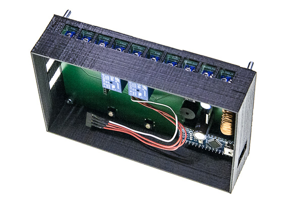

Place the board inside the back half of the box. Put 4 screws through the holes in the board and in the box.

Put those screws sticking from the rear of the box through the brackets on the upper rail.

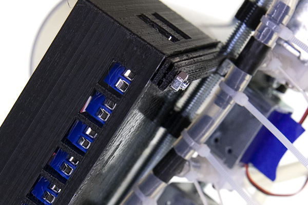

Tighten it all with 4 nuts from the back.

### Connecting power electronics

Before valves can be connected to the main board, the wires need to be prepared.

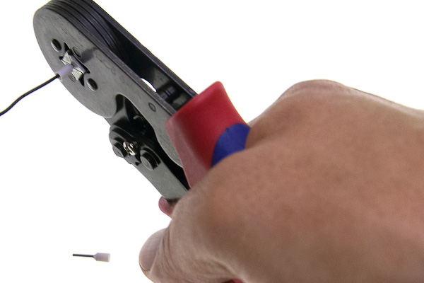

The optimal way is crimping the ferrules.
Covering ends of wires with solder using soldering iron is not optimal, since the solder slowly deforms under pressure with time and connection may become loose, but better than nothing.
Screwing the wires as is is strongly not recommended.

If the pumps have already pre-soldered wires, you can use them or replace if the length is not enough.
A nice way is to solder nothing to the pumps and use the contact terminals instead.

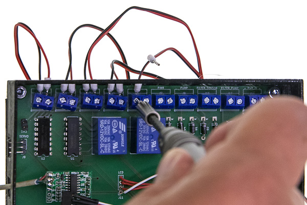

Put each pair of wires of each valve into the screw terminals and tighten them with screws.
Polarity does not matter in case of valves.

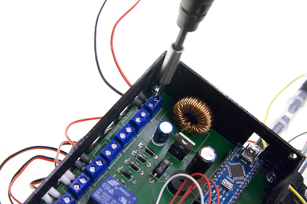

Connect the rightmost terminal to the power supply, here the polarity is important, make sure that the negative contact is on the left, and the positive is on the right.

To the left of the power terminal is magnetic sensor for the filter and further to the left is the filter pump, both cave no incorrect polarity, unless you are using a different from the recommended bidirectional pump.

Fourth terminal from the right is the main pump.
Polarity is important here, but your pump **may** theoretically have different polarity.
In case it does, don't worry, just do the test run in the end and check that the pump moves the water in the right direction and change the polarity of this pump.
If the hoses are connected as depicted, connect the wires as depicted, negative on the left, positive on the right.
If your pump runs in the wrong direction, either reverse wires polarity or reverse hoses connections.

### Signal-level electronics and front panel

Connect the force gauge, to 4-pin connector and the agitation module to a 3-pin connector as depicted, the polarity is very important.

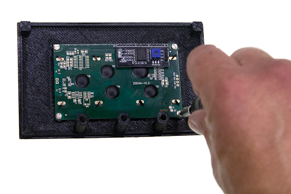

Place the top cover of the electronic box upside down and mount the screen.

Mount the pump switch.

Insert three plastic buttons into their places.
If you do not invert the box completely they do not fall out, but if you struggle with them, you can hold the box screen-down and invert the whole frame to put the box together.

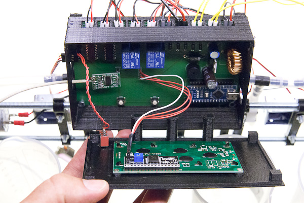

Attach the screen and switch connectors to the board and put the box together.

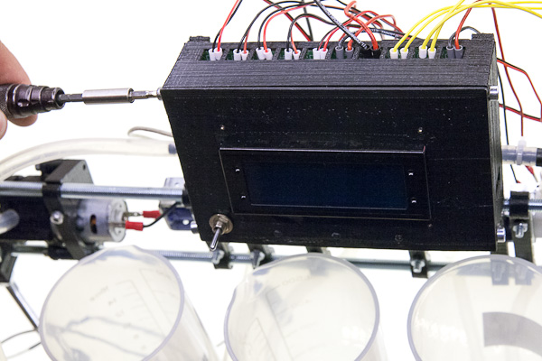

Fix the box halves together with four side-mounted M4x6 screws.
